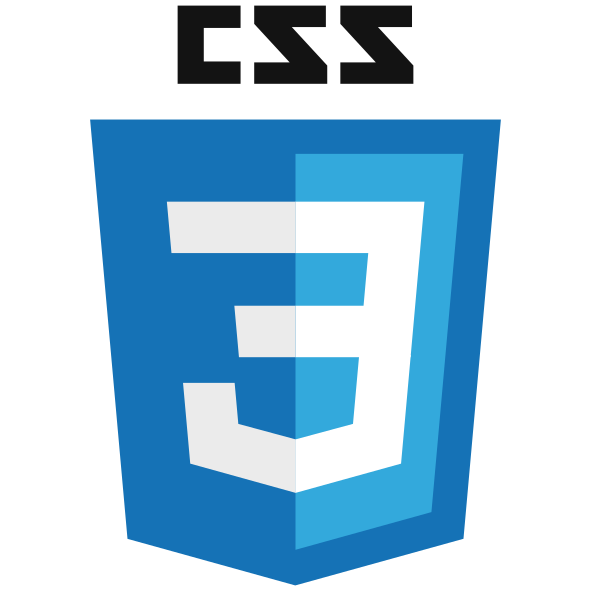

  <h3 align="center" style="text-decoration: none; font-size: 30px">🌷️ Hi , I'm Edith.  </h3>

  <h2 align="center" style="text-decoration: none">Fullstack Development | Physics Research </h1>

  

    🌱  
    I'm passionate about technology and innovation, always looking to challenge myself and learn new things. I enjoy collaborating with others to find new ways to improve life quality and solve community problems.
  

  <!-- Connect -->
  

 <h3>  &nbsp; Connect with me: 
 
   
     </h3>

<!-- My resume -->

<a href="https://firebasestorage.googleapis.com/v0/b/myinfo-d12e3.appspot.com/o/Resume%2FEdithLorenaLosada.pdf?alt=media&token=ad5d9a7c-7b44-4d30-9352-1304d02f9d80" target="blank" style="text-decoration: none"><h3 style='display: inline;font-size: 20px'>My Resume</h3></a>

<!-- Languages and Tools -->
<h2 style="margin-top:20px">🛠️  &nbsp; Languages and Tools  </h2>

 
  <!-- <table align="left" style="margin-left: 50px; margin-top: 20px;  background-color: #f0f0f0; margin-bottom: 20px;border: none"> -->
  <table  style="align-self: center; margin-left: 50px; margin-top: 20px; border: none">
  <tr valign="top" style="border: none">
  <td style="border: none" width="250">

  <h3>Frontend Development</h3>

  

  
HTML

  
CSS

  <a href="https://babeljs.io/" target="blank">
  

  </a>BABEL

  <a href="https://getbootstrap.com/" target="blank">
  

  </a>BOOTSTRAP

  <a href="https://webpack.js.org/" target="blank">
  

  </a>WEBPACK

  <a href="https://reactjs.org/" target="blank">
  

  </a>REACT

  <a href="https://reactjs.org/" target="blank">
  

  </a>REACT

  <a href="https://redux.js.org/" target="blank">
  

  </a>REDUX

  

  </td>
  <td style="border: none" width="250">

  <h3>Backend Development</h3>
  

  <a href=" https://www.nginx.com/" target="blank">
  

  </a>NGINX

  <a href="https://nodejs.org/en/" target="blank">
  

  </a>NODEJS

  <a href="https://expressjs.com/" target="blank">
  

  </a>EXPRESS

  

  <h3>Backend as a Service</h3>
  

  <a href=" https://firebase.google.com/?hl=es" target="blank">
  

  </a>FIREBASE

  <a href="https://www.heroku.com/" target="blank">
  

  </a>HEROKU

  

  <h3>Database</h3>
  

  <a href=" https://www.postgresql.org/" target="blank">
  

  </a>POSTGRESQL

  

  </td>
  <td style="border: none" width="150">

  <h3>Software</h3>
  

  <a href=" https://www.postman.com/" target="blank">
  

  </a>POSTMAN

  <a href="https://www.figma.com/" target="blank">
  

  </a>FIGMA

  

  <h3>Devops</h3>
  

  
 GNU-BASH
  

  

  <h3>Other</h3>
  

    <a href=" https://git-scm.com/" target="blank">
      

    </a>GIT

    
 LINUX
    

  

  </td>
  </tr>
  </table>

<!-- Portfolio -->

  
<a href="https://edithlosada.github.io/" target="blank" style="text-decoration: none"><h3 style='display: inline;font-size: 20px'>💼 Portfolio</h3></a>
  

  - ### Integra (Management system designed to be used in health sector)
  - ### Videogames (API to search and filter videogames)

<h2 style="margin-top: 50px; margin-bottom: 35px;">📈 Stats</h2>

  
&nbsp;

  <!-- 

 -->

  

<h1 align="center"></h1>